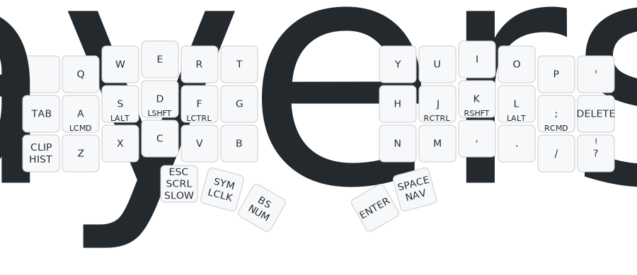

# Charybdis Wireless Mini ZMK Firmware - Assembly & Build Guide

[](https://github.com/280Zo/charybdis-wireless-mini-zmk-firmware/actions/workflows/build.yml)

This comprehensive guide covers the assembly of the **Charybdis Wireless Mini keyboard** with trackball support and the complete firmware building process for both **Bluetooth/USB** and **Dongle** configurations.

---

## Hardware Requirements

### Essential Components

| Component | Notes |
|-----------|-------|
| **nice!nano v2** | Microcontroller (2 units for split keyboard) |
| **MX Switch Sockets** | For mechanical switches |
| **Diodes** | 1N4148 signal diodes (1 per key) |
| **Stabilizers** | For longer keys (spacebar, etc.) |
| **PMW3610 Sensor** | Trackball sensor (right half) |
| **Mechanical Switches** | MX-compatible switches (36-42 keys depending on layout) |
| **Keycaps** | Any standard MX keycaps |
| **USB-C Cable** | For flashing and programming |
| **Battery** | See [Battery Recommendations](#battery-recommendations) |

### Case Files

3D-printable case files are available in the `case/` directory:

- **Left half**: `left_case.stl`, `left_plate.stl`
- **Right half**: `right_case.stl`, `right_plate.stl`
- **Trackball mount**: Files in `case/trackball/`
- **Dongle case**: Files in `case/dongle/`

---

## Battery Recommendations

### Right Half Battery (Critical for Trackball)

⚠️ **IMPORTANT:** The PMW3610 trackball sensor consumes significant power. I **recommend using a 1000mAh** for the right half instead of a standard 130mAh battery.

#### Battery Comparison

| Capacity     | Runtime | Notes |
|--------------|---------|-------|
| **130mAh**   | ~2-3 days | Insufficient for trackball usage|
| **1000mAh**  | ~7-10 days | **Recommended** for trackball configurations |

#### Battery Selection Tips

1. **Form Factor**: Ensure the battery fits within the allocated space in your case
2. **Connector**: Use JST-PH 2.0 connectors for consistency
3. **Quality**: Choose reputable brands (e.g., Adafruit, Sparkfun)
4. **Voltage**: Should be 3.7V nominal (standard LiPo/LiPo)

#### Left Half Battery

The left half can use a standard **500mAh battery** since it doesn't power the trackball sensor.

### Installation Notes

- Route battery cables through designated paths to avoid pinching
- Use kapton tape to insulate battery connectors
- Secure batteries with double-sided tape or velcro
- Leave enough space for safe removal and replacement
- Never force batteries into tight spaces; modify the case if needed

---

## Building Firmware

### Option 1: Local Build (Recommended for Quick Testing)

The fastest way to build firmware locally is using the containerized Docker build system.

#### Prerequisites

- [Docker](https://docs.docker.com/get-docker/)
- [Docker Compose](https://docs.docker.com/compose/install/)
- This repository cloned on your machine

#### Build Commands

```bash
# Navigate to the local build directory
cd local-build

# Build all firmwares
docker-compose run --rm builder

# Build specific shield (e.g., charybdis_bt for Bluetooth only)
docker-compose run --rm builder -s charybdis_bt

# Build specific keymap (e.g., qwerty only)
docker-compose run --rm builder -k qwerty

# Enable USB logging for debugging
docker-compose run --rm builder -l true
```

#### Output

The built firmware files will be in `build_output/` organized by shield and keymap:

```
build_output/
├── charybdis_bt_qwerty/
│   ├── charybdis_left.uf2
│   └── charybdis_right.uf2
├── charybdis_dongle_qwerty/
│   ├── charybdis_left.uf2
│   ├── charybdis_right.uf2
│   └── charybdis_dongle.uf2
└── ...
```

See the [local build README](local-build/README.md) for more details, including USB logging and troubleshooting.

### Option 2: GitHub Actions (CI/CD Pipeline)

For automatic builds on every push:

1. **Fork or clone** this repository
2. **Push your changes** to GitHub
3. **GitHub Actions** automatically builds your firmware
4. **Download artifacts** from the Actions tab

#### Advantages

- No local toolchain setup required
- Builds run on GitHub servers
- Automatic artifact publishing
- Perfect for collaborative development

#### Disadvantages

- Slower feedback loop (~5-10 minutes per build)
- Requires GitHub account
- Limited to GitHub's CI/CD schedule

---

## Dongle + Trackball Configuration

### Overview

The dongle configuration allows you to use a **wireless dongle with USB connection**, supporting the **PMW3610 trackball sensor** for an all-in-one wireless input device.

### Components Required

- **Charybdis Dongle** (receiver with nice!nano v2)
- **Left and right keyboard halves**
- **PMW3610 trackball sensor** (mounted on right half)
- **USB-C cable** (for connection to computer)
- **Appropriate batteries** (see [Battery Recommendations](#battery-recommendations))

### Configuration Files

Dongle-specific configurations are in `boards/shields/charybdis_dongle/`:

- `charybdis_dongle.conf` - Dongle-specific settings
- `charybdis_dongle.overlay` - Pin definitions
- Keyboard halves use same files as Bluetooth version

### Trackball + Dongle Features

- **Full trackball support** with PMW3610 sensor
- **USB connection** to computer
- **Shared configuration** between Bluetooth and Dongle modes

### Building Dongle Firmware with Trackball

```bash
cd local-build

# Build dongle firmware with trackball support
docker-compose run --rm builder -s charybdis_dongle -k qwerty
```

### Trackball Behavior Configuration

All trackball parameters are configured in `config/charybdis_pointer.dtsi`:

```dts
// Example: Adjust pointer speed
// Modify values in charybdis_pointer.dtsi
pointer {
    speed = <1000>;      // Pointer speed multiplier
    acceleration = <0>;  // Acceleration curve
};

// Example: Configure scrolling
scrolling {
    speed = <5>;         // Scroll speed
};
```

For detailed trackball customization, see [Modifying Trackball Behavior](#modifying-trackball-behavior) in the main README.

### Dongle Display Support

> **Note:** Display support for the dongle is currently under development. Check the [zmk-dongle-screen](https://github.com/janpfischer/zmk-dongle-screen) repository for the latest updates.

The dongle can be equipped with a **1.69" SPI display** for status information. Wiring guide available in `docs/nice_nano_wire_guide.md`.

---

## Keyboard Layouts

This firmware supports multiple keyboard layouts out of the box:

### Supported Layouts

| Layout | File | Status | Notes |
|--------|------|--------|-------|
| **QWERTY** | `config/keymap/qwerty.keymap` | ✅ Primary | Standard English layout |
| **Polish** | Custom config | ✅ Supported | See [Polish Layout](#polish-layout) |
| **Russian** | Custom config | ✅ Supported | See [Russian Layout](#russian-layout) |

### Polish Layout

Polish keyboard layout is fully supported through custom key mappings. Configuration files:

- `config/keys_pl.h` - Polish character definitions
- Add to your keymap: `#include "keys_pl.h"`

Polish-specific keys include: Ą, Ć, Ę, Ł, Ń, Ó, Ś, Ź, Ż and their uppercase variants. No need to switch. Use RAlt for special characters.

### Russian Layout

Russian (Cyrillic) keyboard layout is fully supported. Configuration files:

- `config/keys_ru.h` - Russian character definitions
- Add to your keymap: `#include "keys_ru.h"`

Russian-specific keys provide access to Cyrillic alphabet and common symbols.
To enable Russian input, switch your OS keyboard layout to Russian(cmd+space) and switch to Russian layer(will enable all required inputs).

### Adding Custom Layouts

To add a new layout:

1. Create a new `.keymap` file in `config/keymap/`
2. Define your key mappings following ZMK syntax
3. Reference any custom key definitions (e.g., `keys_pl.h`, `keys_ru.h`)
4. Build the firmware - it will automatically detect and build your new layout

Example:

```bash
# Copy and modify an existing keymap
cp config/keymap/qwerty.keymap config/keymap/my_layout.keymap

# Edit my_layout.keymap with your custom mappings

# Build - it will automatically include my_layout
cd local-build
docker-compose run --rm builder
```

---

## Flashing Firmware

### Prerequisites

- Downloaded firmware (`.uf2` files)
- USB-C cable
- One device at a time (you'll repeat for each half/dongle)

### Flashing Steps

1. **Unzip the firmware package**

   ```bash
   unzip charybdis-qwerty-dongle.zip
   ```

2. **Enter bootloader mode**

   - Plug the device into your computer via USB
   - **Double-press the reset button** on the nice!nano v2
   - The device should mount as `NICENANO` storage device

3. **Copy the firmware file**

   ```bash
   # On Windows
   copy charybdis_left.uf2 F:\  # Replace F:\ with your NICENANO drive

   # On macOS/Linux
   cp charybdis_left.uf2 /Volumes/NICENANO/
   ```

4. **Wait for programming**

   - The file will be copied
   - The device will automatically unmount
   - LED will flash indicating successful programming
   - The device will restart

5. **Repeat for other halves**

   - Repeat steps 2-4 for `charybdis_right.uf2`
   - If using dongle, also flash `charybdis_dongle.uf2`

### First-Time Setup

> ⚠️ **Important:** If flashing for the first time or switching between Bluetooth and Dongle configurations:

1. **Flash the reset firmware first** to all devices:

   ```bash
   # Available in firmwares/ directory
   # Flash settings_reset.uf2 to each device
   ```

2. Then proceed with normal firmware flashing

This clears any previous pairing information and ensures a clean state.

### Troubleshooting Flashing

- **Device not mounting**: Try a different USB port or cable
- **Still in bootloader**: Hold reset button while plugging in for 3 seconds
- **File copy fails**: Ensure the drive is properly mounted
- **Device won't restart**: Check the firmware file is not corrupted

---

## Modifying Trackball Behavior

The trackball uses ZMK's modular input processor system for easy customization.

### Configuration File

All trackball settings are in `config/charybdis_pointer.dtsi`.

### Common Adjustments

#### Pointer Speed

```dts
// In charybdis_pointer.dtsi
pointer {
    speed = <1000>;  // Increase for faster movement (1000-2000)
};
```

#### Acceleration

```dts
// Add acceleration curve
pointer {
    acceleration = <250>;  // Adjust sensitivity ramp-up
};
```

#### Scroll Behavior

```dts
// Configure scrolling
scrolling {
    speed = <5>;  // Scroll distance per movement
};
```

#### Precision Mode

```dts
// Slow pointer speed for detailed work
slow-pointer {
    speed = <200>;  // Much slower than normal
};
```

### Building After Changes

After modifying `charybdis_pointer.dtsi`:

```bash
cd local-build
docker-compose run --rm builder
```

The changes will be compiled into the new firmware.

---

## Customizing Keymaps

### Using ZMK Studio (Bluetooth Only)

[ZMK Studio](https://zmk.studio/) allows real-time keymap editing on supported devices.

1. Build Bluetooth firmware
2. Pair keyboard to computer
3. Open [zmk.studio](https://zmk.studio/) in your browser
4. Connect to keyboard
5. Modify keymaps in real-time
6. Changes persist on the device

Dongle support is coming soon.

### Using Keymap Editor GUI

[nickcoutsos' keymap editor](https://nickcoutsos.github.io/keymap-editor/) provides a visual interface:

1. Fork/clone this repository
2. Open the keymap editor
3. Give it access to your GitHub repo
4. Select your branch
5. Modify keys visually
6. Save changes (auto-commits and triggers GitHub Actions)
7. Download built firmware

### Direct Keymap Editing

Edit `config/keymap/qwerty.keymap` (or your layout file) directly:

```dts
// Add layers, modify behaviors, change keycodes
// See ZMK documentation: https://zmk.dev/docs/features/keymaps
```

---

## Keyboard Layers
### Overview & Usage



To see all the layers check out the [full render](keymap-drawer/qwerty.svg).

| # | Layer       | Purpose                                      |
|---|-------------|----------------------------------------------|
| 0 | **BASE**    | Standard typing with home-row mods(ENG+POL)  |
| 1 | **RUSSIAN** | Russian layout with home-row mods            |
| 2 | **NUM**     | Numbers + function keys                      |
| 3 | **NAV**     | Navigation, arrows, paging                   |
| 4 | **SYM**     | Symbols and punctuation                      |
| 5 | **EXTRAS**  | Shortcuts, Bluetooth controls                |
| 6 | **SLOW**    | Low-speed pointer mode                       |
| 7 | **SCROLL**  | Vertical/horizontal scrolling and navigation |
| 8 | **FUNC**    | Functional                                   |

🏠 Home-Row Mods
| Side                | Hold = Modifier              | Tap = Letter / Key  |
| ------------------- | ---------------------------- | ------------------- |
| Left                | **Gui / Alt / Shift / Ctrl** | `A S D F`           |
| Right               | **Ctrl / Shift / Alt / Gui** | `J K L ;`           |


🔗 Combos
| Trigger Keys              | Result                                 |
| ------------------------- | -------------------------------------- |
| `K17 + K18`               | **Caps Word** (one-shot words in CAPS) |
| `K25 + K26`               | **Left Click**                         |
| `K26 + K27`               | **Middle Click**                       |
| `K27 + K28`               | **Right Click**                        |
| `K13 + K22`               | Toggle **MOUSE** layer                 |
| `K38 + K39` (thumb cluster)| Layer-swap **BASE ⇄ EXTRAS**           |


⚙️ Other Highlights
- **Timeless home row mods:** Based on [urob's](https://github.com/urob/zmk-config#timeless-homerow-mods) work and configured on the BASE layer with balanced flavor on both halves (280 ms tapping-term, and quick-tap with prior-idle tuning).
- **Thumb-scroll mode:** Hold the left-most thumb button (K36) while moving the trackball to turn motion into scroll.
- **Precision cursor mode:** Double-tap, then hold K36 to drop the pointer speed, release to return to normal speed.
- **Mouse-Click + Symbol-Layer - K37**
    - Tap: Left mouse click
    - Tap & Hold: Layer 3 (symbols) while the key is held
    - Double-Tap & Hold: holds the left mouse button
    - Tripple-Tap: Double mouse click
- **Backspace + Number-Layer - K38**
    - Tap: Backspace
    - Hold: Layer 1 (numbers) while the key is held
    - Double-Tap & Hold: Keeps Backspace held
- **Bluetooth profile quick-swap:** Jump to the EXTRAS layer and tap the dedicated BT-select keys to pair or switch among up to four saved hosts (plus BT CLR to forget all).
- **PMW3610 low power trackball sensor driver:** Provided by [badjeff](https://github.com/badjeff/zmk-pmw3610-driver)
    - Patched to remove build warnings and prevent cursor jump on wake
- **Hold-tap side-aware triggers:** Each HRM key only becomes a modifier if the opposite half is active, preventing accidental holds while one-handed.
- **Quick-tap / prior-idle:** Tuned for faster mod-vs-tap detection.
- **ZMK Studio:** Supported on BT builds for quick and easy keymap adjustments. Dongle support will come soon.

---

## Troubleshooting

### Connection Issues

**Problem:** Keyboard halves aren't connecting (Bluetooth)

**Solutions:**
1. Press reset button on both halves simultaneously
2. Follow [ZMK connection troubleshooting](https://zmk.dev/docs/troubleshooting/connection-issues#acquiring-a-reset-uf2)
3. Flash reset firmware to both halves
4. Re-pair from Bluetooth settings

### Trackball Issues

**Problem:** Trackball not moving or erratic movement

**Solutions:**
1. Verify PMW3610 sensor is properly soldered
2. Check pin connections with multimeter
3. Adjust pointer speed in `charybdis_pointer.dtsi`
4. Verify I2C/SPI lines for interference
5. Test with a different sensor if available

**Problem:** Trackball drains battery quickly

**Solutions:**
1. Use 1000mAh or larger battery (see [Battery Recommendations](#battery-recommendations))
2. Lower pointer speed to reduce sensor polling
3. Enable low-power mode if available in firmware
4. Check for sensor firmware updates

### Firmware Issues

**Problem:** Firmware won't flash

**Solutions:**
1. Try different USB port or cable
2. Verify device is in bootloader mode (NICENANO should appear)
3. Check firmware file integrity
4. Update bootloader if needed

**Problem:** Keys not responding

**Solutions:**
1. Test switches individually
2. Verify diodes are installed with correct polarity
3. Check for cold solder joints with a magnifying glass
4. Test with continuity meter
5. Rebuild firmware and re-flash

### Layout Issues

**Problem:** Polish/Russian characters not working

**Solutions:**
1. Ensure you included the correct character definitions file
2. Check keymap is properly configured
3. Verify your system keyboard layout supports these languages
4. Test individual key codes

---

## Credits & References

This project builds upon the excellent work of the ZMK community and specialized contributors:

### Original Projects & Authors

#### Charybdis Keyboard Hardware
- **[280Zo/charybdis-wireless-mini-3x6-build-guide](https://github.com/280Zo/charybdis-wireless-mini-3x6-build-guide)** - Wireless Charybdis keyboard design and assembly guide

#### ZMK Firmware
- **[ZMK Firmware Project](https://zmk.dev/)** - Modern open-source keyboard firmware for wireless input devices
- **[janpfischer/zmk-dongle-screen](https://github.com/janpfischer/zmk-dongle-screen)** - ZMK dongle with display support and configuration examples
- **[nickcoutsos/keymap-editor](https://github.com/nickcoutsos/keymap-editor)** - Visual keymap editor for ZMK
- **[caksoylar/keymap-drawer](https://github.com/caksoylar/keymap-drawer)** - Keymap visualization tool
- **[badjeff/zmk-pmw3610-driver](https://github.com/badjeff/zmk-pmw3610-driver)** - PMW3610 trackball sensor driver for ZMK
- **[urob/zmk-config](https://github.com/urob/zmk-config)** - Timeless home-row mods implementation
- **[eigatech](https://github.com/eigatech)** - Community contributions

---

## Additional Resources

- **[ZMK Documentation](https://zmk.dev/docs/)** - Official ZMK guide and API reference
- **[PMW3610 Sensor Specs](https://www.pixart.com.tw/)** - Sensor specifications

---

## Support & Issues

- **Found a bug?** Open an issue on the [main repository](https://github.com/280Zo/charybdis-wireless-mini-zmk-firmware)
- **Need help?** Check the troubleshooting section or ask in the ZMK community
- **Have improvements?** Submit a pull request!

---

